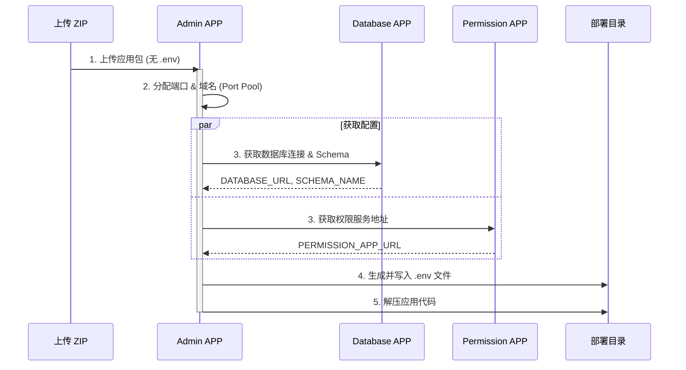

# OpenOne - 多应用微前端管理平台

OpenOne 是一个基于 **Next.js** + **Monorepo**
架构的企业级多应用管理平台。它提供了一套完整的微前端基础设施，支持业务 APP
的独立开发、打包上传和动态加载，实现了核心能力（权限、数据库、配置）的统一管理与业务功能的解耦。

## 1. 快速开始

### 环境准备

- Node.js >= 20.0.0
- PNPM 9.x
- Docker (用于 PostgreSQL)

### 启动流程

```bash
# 1. 安装依赖
pnpm install

# 2. 启动数据库容器
docker-compose up -d

# 3. 初始化环境变量 (每APP独立配置)
# Windows (PowerShell):
Get-ChildItem apps -Directory | ForEach-Object { Copy-Item "$($_.FullName)/.env.example" "$($_.FullName)/.env" -ErrorAction SilentlyContinue }
# Linux/Mac:
# for d in apps/*/; do cp "$d.env.example" "$d.env" 2>/dev/null; done

# 4. 启动所有服务 (Turbo并行启动)
pnpm dev
```

启动后访问入口: **[http://localhost:3000](http://localhost:3000)**

## 2. 系统架构

### 2.1 整体设计

平台采用 **Monorepo** 组织代码，**微前端** 架构运行应用：

- **Shell (基座)**: 负责加载子应用、聚合菜单、处理路由。
- **Core Apps (核心服务)**: 提供认证、权限、配置管理等基础能力。
- **Business Apps (业务应用)**: 独立开发、独立数据库 Schema、作为插件动态加载。

```mermaid
graph TD
    User[用户] --> Shell[Shell App (基座) :3000]
    
    subgraph Core Services
        Auth[Auth App :3001]
        Admin[Admin App :3002]
        Perm[Permission App :3003]
        DB[Database App :3004]
    end
    
    subgraph Business Apps
        Order[Order App]
        CRM[CRM App]
    end
    
    Shell --> Auth
    Shell --> Admin
    Shell --> Perm
    Shell --> DB
    Shell --> Order
    Shell --> CRM
```

### 2.2 核心服务职责

| 服务           | 端口 | 核心职责                                              | .env 管理范围                 |
| :------------- | :--- | :---------------------------------------------------- | :---------------------------- |
| **shell**      | 3000 | **基座**：Wujie微前端加载器、全局路由、菜单聚合       | —                             |
| **auth**       | 3001 | **认证中心**：用户登录、JWT令牌签发与刷新             | —                             |
| **admin**      | 3002 | **管理中心**：APP上传/发布、版本管理、**端口分配**    | `PORT`, `APP_URL`, 服务地址   |
| **permission** | 3003 | **权限中心**：RBAC模型、角色/资源管理、**权限下发**   | `PERMISSION_*`, `RBAC_*`      |
| **database**   | 3004 | **数据中心**：Schema元数据、DDL迁移执行、**连接下发** | `DATABASE_URL`, `SCHEMA_NAME` |

## 3. 核心机制解析

### 3.1 环境变量管理架构

OpenOne 采用 **"本地独立配置，生产统一分发"**
的策略，解决了微前端架构下配置碎片化的问题。

#### 本地开发模式

每个 APP 目录下拥有独立的 `.env` 文件，由 Next.js
自动加载。开发者需自行维护本地配置。

#### 生产/发布模式

APP 以 ZIP 包形式上传。**ZIP 包中不包含 `.env`**。Admin APP
在处理上传时，会协调各核心服务，动态生成 `.env` 并注入到部署目录。



> **核心代码**: `@openone/utils/src/env.ts` (工具函数) 和
> `apps/admin/src/app/api/env/assign/route.ts` (分发逻辑)。

### 3.2 数据库隔离架构

采用 **PostgreSQL Schema Isolation** 策略。即共用一个物理数据库实例，但每个 APP
独占一个 Schema。

- **Platform Schemas**: `public`, `auth`, `platform` (存储元数据)
- **App Schemas**: `app_order`, `app_crm` (业务数据隔离)

**开发流程**:

1. APP 定义 `drizzle` schema 时指定 `pgSchema('app_name')`。
2. `drizzle-kit generate` 生成 SQL 迁移文件。
3. APP 上传时，Admin 调用 Database APP 接口，自动在目标库执行 SQL 创建/更新
   Schema。

## 4. 关键工作流

### APP 上传与部署流程

第三方 APP 开发完成后，打包为 ZIP（包含 `next.config`, `package.json`, `.next/`,
`public/` 等）。

1. **上传**: POST `/api/upload` 到 Admin APP。
2. **校验**: 检查 `openone.config.json` 配置文件。
3. **环境注入**: Admin 分配端口，生成 `.env`。
4. **权限同步**: 解析 `permissions` 字段，通过 API 同步到 Permission APP。
5. **Schema同步**: 解析 SQL 迁移文件，通过 API 同步到 Database APP 执行 DDL。
6. **注册**: 在 Admin 数据库写入 APP 版本记录。

## 5. 项目结构

```
e:/openone/
├── apps/                   # 微前端应用集
│   ├── admin/              # 管理后台
│   ├── auth/               # 认证服务
│   ├── database/           # 数据库服务
│   ├── permission/         # 权限服务
│   └── shell/              # 基座应用
├── packages/               # 共享工作区
│   ├── database/           # 数据库Client封装 (Schema隔离逻辑)
│   ├── types/              # 全局类型定义 (AppConfig, EnvConfig)
│   └── utils/              # 通用工具 (Logger, EnvManager, Auth)
├── templates/              # 脚手架模板
└── scripts/                # 运维脚本
```

## 6. 开发规范

- **端口**: 本地开发端口由 `.env` 控制，生产环境由 Admin 自动分配。
- **数据库**: 禁止跨 Schema 直接联表查询，必须通过 API 通信。
- **样式**: 统一使用 TailwindCSS，遵循 `@openone/ui` (规划中) 规范。
- **语言**: 全面采用 TypeScript，严格类型检查。
