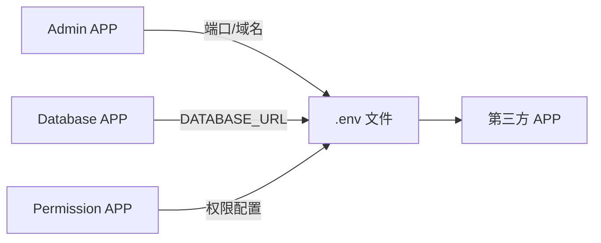

# OpenOne - 多APP管理平台

OpenOne
是一个基于微前端架构的多应用管理平台，旨在提供灵活的插件化应用集成能力。用户可使用
Next.js + Shadcn + TailwindCSS + Drizzle 快速构建业务APP，以 ZIP
包形式上传发布。

## 1. 快速开始

```bash
# 1. 安装依赖
pnpm install

# 2. 启动数据库
docker-compose up -d

# 3. 初始化各APP环境变量（每个APP独立.env）
Get-ChildItem apps -Directory | ForEach-Object { Copy-Item "$($_.FullName)/.env.example" "$($_.FullName)/.env" -ErrorAction SilentlyContinue }
# Linux/Mac: for d in apps/*/; do cp "$d.env.example" "$d.env" 2>/dev/null; done

# 4. 启动所有APP（Turbo并行，端口由各APP .env 的 PORT 控制）
pnpm dev
```

启动后访问：

- **Shell (入口)**: http://localhost:3000
- **登录 (Auth)**: http://localhost:3001 (Default: admin / admin123)
- **APP管理 (Admin)**: http://localhost:3002
- **权限管理 (Permission)**: http://localhost:3003
- **数据库管理 (Database)**: http://localhost:3004

## 2. 技术栈

| 领域         | 技术选型    | 版本     | 备注               |
| :----------- | :---------- | :------- | :----------------- |
| **运行时**   | Node.js     | >=20.0.0 |                    |
| **包管理**   | PNPM        | 9.x      | Workspace monorepo |
| **构建工具** | TurboRepo   | 2.4+     | 增量构建           |
| **前端框架** | Next.js     | 16.1.6   | App Router         |
| **UI 库**    | React       | 19.2.4   | Server Components  |
| **样式**     | TailwindCSS | 4.1.18   |                    |
| **数据库**   | PostgreSQL  | 14+      |                    |
| **ORM**      | Drizzle     | 0.45.1   | + Drizzle Kit      |

## 3. 系统架构

### 3.1 核心设计

平台采用 **Monorepo** + **微前端** 策略：

- **模块化**: 核心基础设施固定，业务功能通过 APP 扩展。
- **独立性**: 每个 APP 拥有独立的数据库 Schema、API 和前端资源。
- **一致性**: 共享统一的 UI 组件库 (`@openone/ui` 待建设)、工具函数和类型定义。

### 3.2 目录结构

```
openone/
├── apps/                   # 业务应用（微前端子应用）
│   ├── admin/              # 管理后台（主应用/基座一部分）
│   ├── auth/               # 认证服务
│   ├── permission/         # 权限中心
│   ├── database/           # 数据库管理服务
│   └── shell/              # 应用壳（Wujie主框架，负责加载子应用）
├── packages/               # 共享库
│   ├── database/           # 数据库连接与核心Schema封装
│   ├── types/              # 全局类型定义
│   └── utils/              # 通用工具函数（HTTP, Logger, Auth）
├── templates/              # 应用模板
│   └── app-template/       # 标准APP脚手架
└── scripts/                # 运维脚本
```

### 3.3 模块依赖

```mermaid
graph TD
    subgraph Apps
        Admin[apps/admin]
        Auth[apps/auth]
        Perm[apps/permission]
        DB_App[apps/database]
    end
    
    subgraph Packages
        PkgDB[@openone/database]
        PkgUtils[@openone/utils]
        PkgTypes[@openone/types]
    end

    Admin --> PkgDB & PkgUtils
    Auth --> PkgDB & PkgUtils
    Perm --> PkgDB & PkgUtils
    DB_App --> PkgDB & PkgUtils
    
    PkgDB --> PkgTypes
    PkgUtils --> PkgTypes
```

## 4. 数据库架构

采用 **PostgreSQL Schema Isolation** 模式，实现多租户/多应用的数据隔离。

### 4.1 Schema 策略

- **Platform Schema**: 存储平台级元数据（如 `schema_registry`, `users`
  基础表）。
- **App Schema**: 每个 APP 拥有独立的 PG Schema（如 `auth`, `permission`）。

### 4.2 开发流程

1. **定义**: 在 `apps/<app>/src/db/schema.ts` 中使用 `pgSchema('app_name')`。
2. **生成**: 使用 `drizzle-kit generate` 生成迁移文件。
3. **同步**: APP 启动时调用 `api/schemas/sync`，Database APP 自动应用变更。

## 5. 核心服务职责

| APP            | 端口 | 职责                                                         | .env 管理范围             |
| :------------- | :--- | :----------------------------------------------------------- | :------------------------ |
| **shell**      | 3000 | Wujie主框架，负责菜单聚合、子应用路由调度                    | —                         |
| **auth**       | 3001 | 认证中心，管理用户、登录、JWT签发                            | —                         |
| **admin**      | 3002 | APP全生命周期管理（上传、发布、版本控制、**端口/域名分发**） | PORT, APP_URL, 服务地址   |
| **permission** | 3003 | RBAC权限模型管理（角色、资源授权、**权限配置分发**）         | PERMISSION__, RBAC__      |
| **database**   | 3004 | 数据库Schema元数据管理、DDL执行引擎、**数据库配置分发**      | DATABASE_URL, SCHEMA_NAME |

### 5.1 环境变量管理

每个 APP 拥有独立的 `.env` 文件，由 Next.js 自动加载。打包后的第三方 APP 的
`.env` 由三大核心服务分别生成：



## 6. 开发规范

- **命名**: 目录/包名优先单单词（如 `db`, `utils`），API使用 camelCase。
- **数据库**: 表名使用 snake_case 复数（如 `users`, `roles`）。
- **版本**: 遵循 Semantic Versioning。
